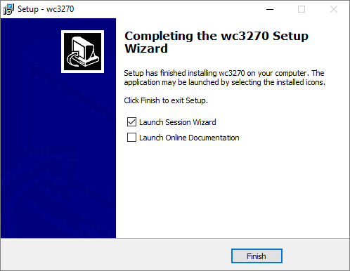
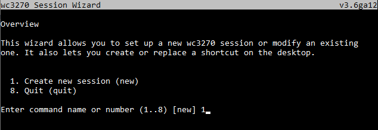
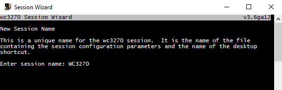
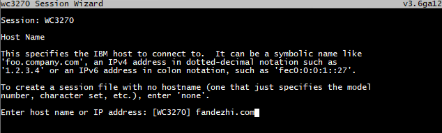
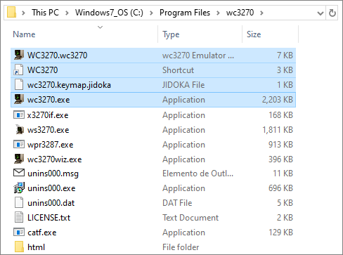
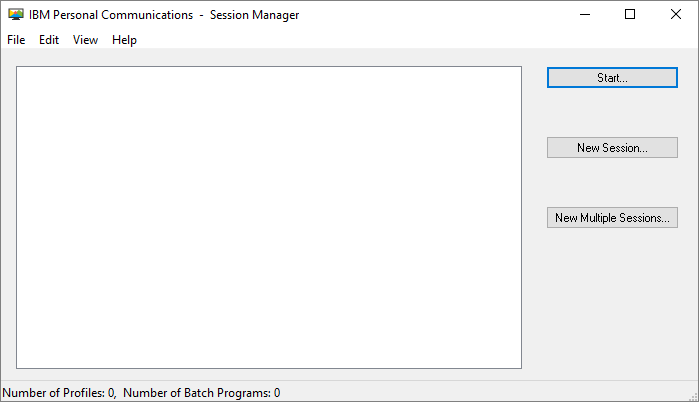
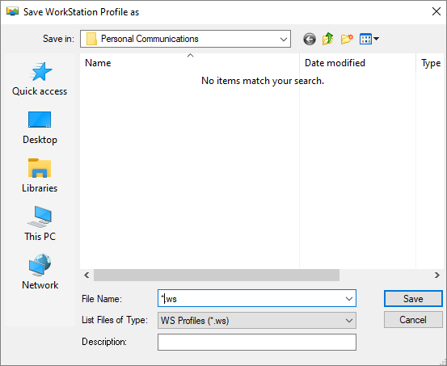
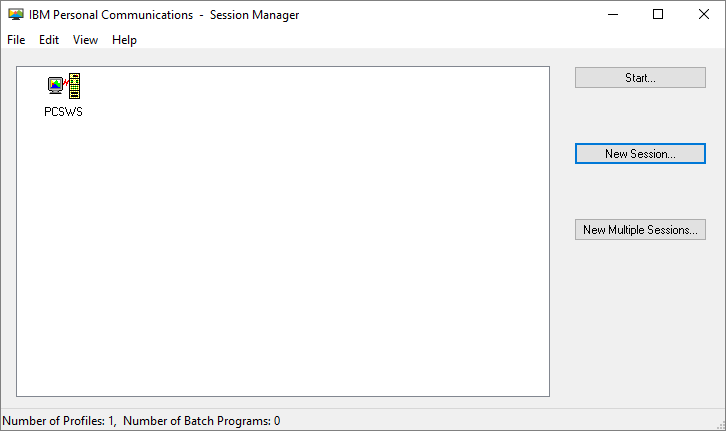

# Snippet 3270 Manager Robot

The IBM3270 Manager Robot provides a complete usage example from all the correspondent snippet methods. It opens an IBM3270 terminal using the emulator indicated as the robot's parameter, goes to a menu page and tries to change the user's password.

Finally the robot closes the emulator.

### Installation

The Snippet 3270 Manager Robot is distributed using Maven:
```xml
<dependency>
	<groupId>com.appian.rpa.snippets.examples</groupId>
	<artifactId>robot-snippet-3270-manager</artifactId>
	<version>0.0.1</version>
</dependency>
```
#### Emulators Installation

This robot allows its execution in two different clients:
- IBM Personal Communications
- WC3270

The following describes how to perform the installation of the emulators and the configuration of a session.

#### wc3270

- Download the emulator from the following url:
http://x3270.bgp.nu/download.html
*(select the stable version from Windows Setup .EXEs)*


- After downloading, run the wc3270 setup wizard.

<p align="center">
  
</p>

- Execute a default installation, leave the options suggested by the wizard. In the last screen, select 'Launch Session Wizard' and finish the installation.

<p align="center">
  
</p>

- On the 'wc3270 Session Wizard' terminal select option **1** to create a new session.

<p align="center">
  
</p>

- Enter the session name, for this robot the session name is **WC3270**.

<p align="center">
  
</p>

- Enter the host name, this robot uses the free server **fandezhi.com**.

<p align="center">
  
</p>

- None of the default options need to be changed.

  Create a public session file (WC3270.wc3270) and create a desktop icon for quick access to the session, as shown in the picture.

<p align="center">
  
</p>

- Finally, a screen is displayed informing you that the session and its shortcut have been successfully created.

<p align="center">
  
</p>

- To enable the robot to open the emulator with the session created, it is necessary to move 3 files to the folder where the executable is located (usually C:\Program Files\wc3270). This files are:


    - The session file **WC3270.wc3270**.
    
    - The **WC3270 link** created on the desktop.
    
    - The file **wc3270.keymap.jidoka**, that is included as a support file in the robot.

<p align="center">
  
</p>

- Finally, we must modify the **WC3270 link** to include the keymap, to do so, we edit the link:

	"C:Program Files\wc3270\wc3270.exe" -keymap "C:Program Files\wc3270\wc3270.keymap.jidoka" +S "C:Program Files\wc3270\WC3270.wc3270"


#### IBM Personal Communications

- Download the free 90-day trial version from the following url:
	https://www.ibm.com/us-en/marketplace/personal-communications
	*(An IBM account is required)*


- Unzip the file PCOMM_V14.0_FOR_Win_EVL.zip and the mtri0507.zip inside it.


- Execute setup.exe and and follow the wizard using the default values to complete the installation.


- From the Windows menu select: IBM Personal Communications -> Start or Configure Sessions.


- In the Session Manager press 'New Session' button.

<p align="center">
  
</p>

- Press Link Parameters

<p align="center">
  
</p>

- In Telnet 3270 windows enter the host, this robot uses the server **fandezhi.com**, and press OK.

<p align="center">
  
</p>

- A print dialog appears, press Cancel Print

<p align="center">
  
</p>

- Go to Files -> Save as, and enter the name session **PCSWS.ws**

<p align="center">
  
</p>

- Exits the terminal, in the Session Managers we can see the new session.

<p align="center">
  
</p>


- To avoid the print dialogue appearing when the session is opened, let's edit the **PCSWS.ws** file and include the following text: 

```
	[LT]
	IgnoreWCCStartPrint=Y
```


### Workflow


### Development
You can find the snippet 3270 Manager in the folder snippets-libraries:

https://github.com/appianps/ps-plugin-appianrpa-Snippets/tree/PS-430-3270/snippets-libraries/snippet-3270-commons