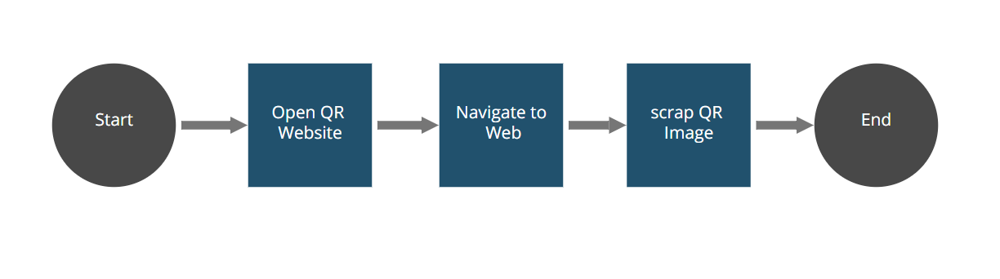

# robot-snippet-QR-manager
 Using QR-text-utils, generate a new robot able to show QR capabilities
 
 ##Process (AS IS)
 The robot navigates to a custom [website](https://javier-advani.github.io/qr-web-sample/) and grabs the QR Image. 
 After that, the robot decodes the image as text. The result is shown in the console as a warning message (yellow coloured).
 
 Please, follow the [setup instructions](https://docs.appian.com/suite/help/20.2/rpa/develop/deploying-code.html) to set your enviroment and run this example.

