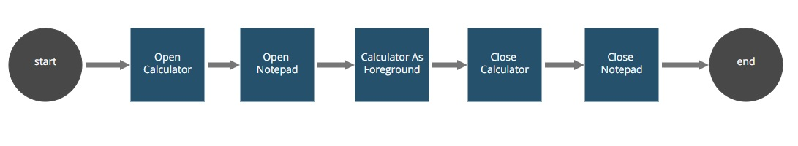

## Application Manager Robot (A snippet usage example)

The Application Manager Snippet Example provides a complete usage example from all the
[ApplicationManager](https://github.com/appianps/ps-plugin-appianrpa-Snippets/tree/master/snippets-libraries/snippet-application-manager) snippet methods.

The Application Manager Robot provides a complete usage example from all the
correspondent snippet methods, interacting with the Windows and Notepad native applications.

Please, follow the [setup instructions](https://docs.appian.com/suite/help/20.1/rpa/develop/deploying-code.html) to set your enviroment and run this example.

### Process (AS IS):

1. **Start.** Initialize the objects involved in the robotic process.
2. **Open Calculator.**  Open the Windows 10 Calculator.
3. **Open Notepad.** Open the Windows 10 Notepad.
4. **Calculator as Foreground.**  If there were multiple windows already opened, the newest element opened set the others as background. This action set the Calculator as the current active window.
5. **Close Calculator.** Close the Calculator Application.
6. **Close Notepad.** Close the Notepad Application.
7. **End.** This is the last non-hidden action from the robot workflow. Release any aditional objects involved in your process.