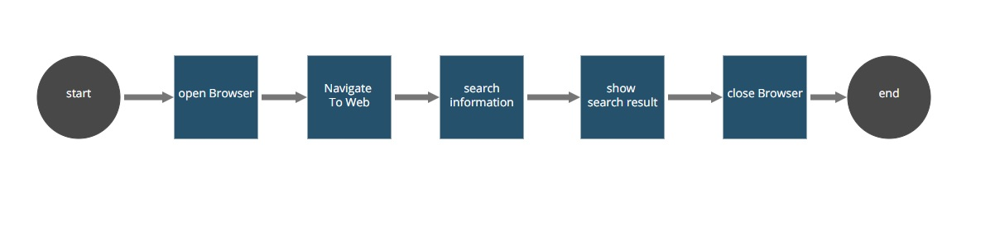

## Browser Manager Robot (A snippet usage example)

The Browser Manager Snippet Example provides a complete usage example from all the
[BrowserManager and SelectorsManager](https://github.com/appianps/ps-plugin-appianrpa-Snippets/tree/master/snippets-libraries/snippet-browser-manager) snippet methods.

This robotic process has been created to illustrate how the Browser Manager Snippet should be integrated in your process. It basically searches the word "Appian" in Google
and shows up the first result found in the console. An exception will be thrown if any error occurs during the process execution.

Please, follow the [setup instructions](https://docs.appian.com/suite/help/20.1/rpa/develop/deploying-code.html) to set your enviroment and run this example.

### Process (AS IS):

1. **Start.** Initialize the objects involved in the robotic process.
2. **Open Browser.**  Open a new Chrome web browser.
3. **Navigate To Web.** Navigate to searcherURL. An exception is thrown if the search button selector was not found.
4. **Search Information.**  Search results for "Appian" String.
5. **Show Search Result.** 	 If the search result was successfully loaded, print the first result found in Console. Otherwise, a JidokaFatalException will be thrown.
6. **Close Browser.** Close the Chrome web browser.
7. **End.** This is the last non-hidden action from the robot workflow. Release any aditional objects involved in your process.
