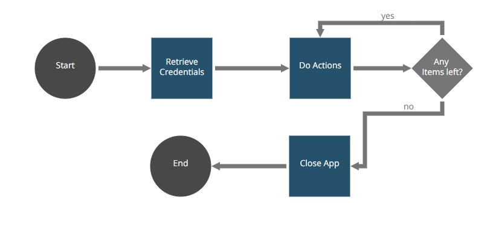

## Robot Snippet Credentials

The Credentials Snippet Example provides a complete usage example from all the
[CredentialsUtils](https://github.com/appianps/ps-plugin-appianrpa-Snippets/tree/master/snippets-libraries/snippet-credentials) snippet methods. The robot will retrieve three existent
credentials (Username + Password) associated to the application "TEST_ROBOT".
In case that these three credentials were not previously created in the
console side, the application will throw an exception.

Please, follow the [setup instructions](https://docs.appian.com/suite/help/20.1/rpa/develop/deploying-code.html) to run this example.

Process [as is]:

1. **Start.** The start method initializes modules and global variables.
2. **Retrive Credentials.**  This method retrieves the three credentials associated to the same TEST_ROBOT application, whether the number of usages is limited or not. A JidokaFatalException is thrown in case that the number of retrievals was already exceeded or simply the desired credential does not exist.
3. **Do actions.** This method let the process confirm if each credential was successfully retrieved or not.
4. **Any Items left?.** Checks if there are more pending items.
5. **Close App.** This method closes the app and updates each the credential usages.
6. **End.** Any further actions to close the robot process can be performed here.
