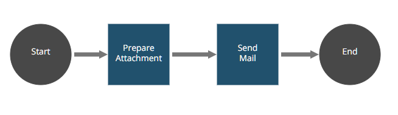

## Email Robot (A snippet usage example)

The Email Snippet Example provides a complete usage example from all the
[EmailManager](https://github.com/appianps/ps-plugin-appianrpa-Snippets/tree/master/snippets-libraries/snippet-email) snippet methods.
The robot sends an email with the given parameters on the RPA console. Also, it uses a Velocity template to fill the body dynamically. The attachment sent is a screenshot.

Please, follow the [setup instructions](https://docs.appian.com/suite/help/20.2/rpa/develop/deploying-code.html) to set your enviroment and run this example.

### Process (AS IS):

1. **Start.** The start method initializes modules and global variables.
2. **prepareAttachment.**  This method prepares the attachments by taking a screenshot to send.
3. **sendMail.** This method sends the email with the given parameters, using the SMTP server configuration.
6. **End.** Any further actions to close the robot process can be performed here.

### Important things to know before execute the robot:
It is important to correctly configure the SMTP server beforehand.
Also, be careful with the following things written on the [EmailManager README](https://github.com/appianps/ps-plugin-appianrpa-Snippets/tree/master/snippets-libraries/snippet-email/README.md).
