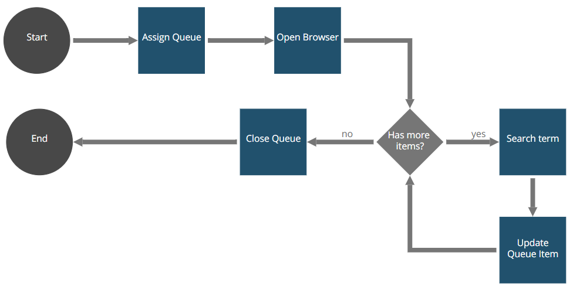

# Snippet Excel Queue Manager Robot

The Snippet Excel Queue Manager Consumer Robot provides a complete usage example from all the correspondent snippet methods to create and process a queue created from an Excel file, or using a preselected queue.

This robot is an example of using the ExcelQueueManager library. The robot creates a queue using the input file given by parameters. Then, it process the queue and uses the search term of the item to search on Google. When the search has finished, it saves of the functional data the number of results and the time required to search. Finally, it closes the queue, updates the Excel file and returns it.

### Installation

The Snippet Excel Queue Manager Robot is distributed using Maven:
```xml
<dependency>
	<groupId>com.appian.rpa.snippets.examples</groupId>
	<artifactId>robot-snippet-generic-queue-manager-filler</artifactId>
	<version>0.0.1</version>
</dependency>
```

### Workflow



Robot console configuration:
[Robot console configuration](./console/robot-snippet-excel-queue-manager-configuration.zip)

### Development
You can find the snippet Excel Queue Manager in the folder snippets-libraries:

https://github.com/appianps/ps-plugin-appianrpa-Snippets/tree/PS-460-queueWithoutExcel/snippets-libraries/queue-manager