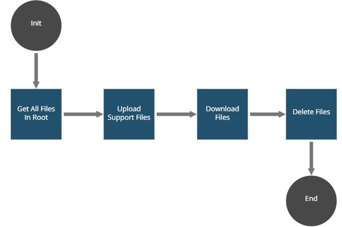

## FTP Client Robot Example (A snippet usage example)

The FTP Client Snippet Example provides a complete usage example from all the
[RpaFtpClient](https://github.com/appianps/ps-plugin-appianrpa-Snippets/tree/master/snippets-libraries/snippet-ftp-client) snippet methods. 

This robot do the basics operations with a FTP using the snippet for FTP management (list, upload, download and remove files from remote). To test this we are going to connect to a Public FTP test site. The files will only be stored for 30 minutes before being deleted (every minute 00 and 30).

All the info about the site can be found in: https://dlptest.com/ftp-test/

We are going to use the console credentials for store the FTP user password (credential application -> "FTP").

Please, follow the [setup instructions](https://docs.appian.com/suite/help/20.3/rpa/develop/deploying-code.html) to set your enviroment and run this example.

### Process (AS IS):

1. **Init** The start method initializes modules and global variables.
2. **Get All Files In Root**  Retrieve and write in the robot log all the files and directories presents in the FTP root directory.
3. **Upload Support Files** Uploads all the support files that have been loaded into the robot. The remote folder for that will be "test_jid".
4. **Download Files** Download all the previously uploaded files in "AppianRPA directory path/ftpDownloadTest/".
5. **Delete Files** Remove all the uploaded files. First remove the first one (to have an example of selective remove) and later the rest together. Finally the remote directory "test_jid" will be delete too.
6. **End.** Any further actions to close the robot process can be performed here.
