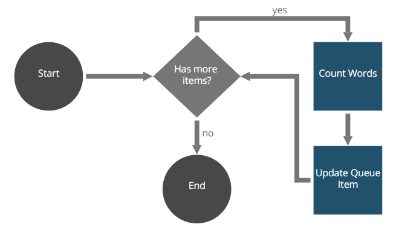

# Snippet Generic Queue Manager Consumer Robot

The Snippet Generic Queue Manager Consumer Robot provides a complete usage example from all the [correspondent snippet methods](https://github.com/appianps/ps-plugin-appianrpa-Snippets/tree/master/snippets-libraries/queue-manager) to process a filled queue.

The robot retrieves an element from the queue and counts the words in the functional data of the element's content. First, the robot assigns today's date to the queue, if it exists. If not, the robot makes an exception. Then, it looks for the pending items in the queue and processes them, assigning one of them to itself and obtaining the field with the file contents. The robot then counts the words in the file contents and updates the functional data field of the queue item that holds the number of words. Finally, the robot finishes if there are no more elements to process.

### Installation

The Snippet Generic Queue Manager Consumer Robot is distributed using Maven:
```xml
<dependency>
	<groupId>com.appian.rpa.snippets.examples</groupId>
	<artifactId>robot-snippet-generic-queue-manager-consumer</artifactId>
	<version>1.0.0</version>
</dependency>
```

### Workflow



Robot console configuration:
[Robot console configuration](./console/robot-snippet-generic-queue-manager-consumer-configuration.zip)

### Development
You can find the snippet Generic Queue Manager in the folder snippets-libraries:

[Queue Manager](https://github.com/appianps/ps-plugin-appianrpa-Snippets/tree/master/snippets-libraries/queue-manager)
