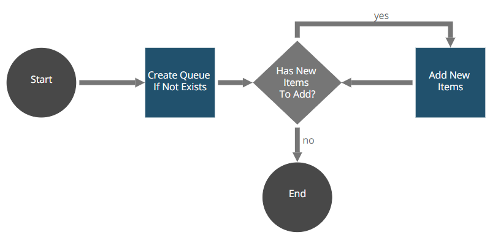

# Snippet Generic Queue Manager Filler Robot

The Snippet Generic Queue Manager File Robot provides a complete usage example from all the correspondent snippet methods to create and assign a new queue, or assign an existing one, and fill the queue, creating new queue items.

The robot searches the files in the folder given by parameters and maps them to elements in the queue, setting the key and empty functional data. First, the robot checks if there is a queue with today's date. If the queue exists, the robot assigns it to itself. If not, the robot creates it and assigns it to itself. Then, it checks if a file was previously added to the queue, and if it was not added, the robot adds it. Finally, the robot finishes, leaving the queue in a pending state.

### Installation

The Snippet Generic Queue Manager Filler Robot is distributed using Maven:
```xml
<dependency>
	<groupId>com.appian.rpa.snippets.examples</groupId>
	<artifactId>robot-snippet-generic-queue-manager-filler</artifactId>
	<version>1.0.0</version>
</dependency>
```

### Workflow



Robot console configuration:
[Robot console configuration](./console/robot-snippet-generic-queue-manager-filler-configuration.zip)

### Development
You can find the snippet Generic Queue Manager in the folder snippets-libraries:

[Queue Manager](https://github.com/appianps/ps-plugin-appianrpa-Snippets/tree/master/snippets-libraries/queue-manager)
