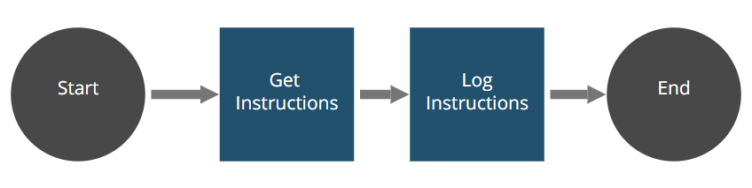

# Snippet Instruction Robot

The Instruction Robot provides a usage example of all the [Instructions Snippet](https://github.com/appianps/ps-plugin-appianrpa-Snippets/edit/master/snippets-libraries/snippet-instruction) methods. The robot reads all the instructions and then assigns them to the corresponding object type. Finally, it prints the values received in the server log.

### Installation

The Snippet Instruction Robot is distributed using Maven:
```xml
<dependency>
	<groupId>com.appian.rpa.snippets.examples</groupId>
	<artifactId>robot-snippet-instruction</artifactId>
	<version>0.0.1</version>
</dependency>
```

### Workflow



### Development
You can find the snippet Instruction in the folder snippets-libraries:

https://github.com/appianps/ps-plugin-appianrpa-Snippets/tree/master/snippets-libraries/snippet-instruction
