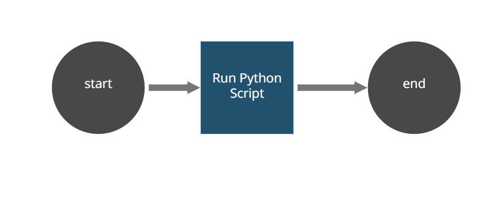

# robot-snippet-QR-manager
 Using the Python snippet, the robot runs a script and shows its execution result (cmd output) in the console. 
 
 ##Process (AS IS)
 The robot runs the test.py script, previously located in any resource's folder (to be a parameter passed before the execution). 
 
 Please, follow the [setup instructions](https://docs.appian.com/suite/help/20.2/rpa/develop/deploying-code.html) to set your enviroment and run this example.

