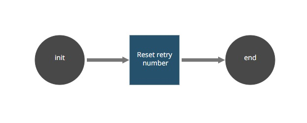

## REST API Robot (A snippet usage example)

The Rest API Snippet Example provides a complete usage example from all the
[REST API](https://github.com/appianps/ps-plugin-appianrpa-Snippets/tree/master/snippets-libraries/snippet-rest-api) snippet methods.

 The Rest API Robot provides a complete usage example from all the correspondent snippet methods. Given a queueItem ID, this robotic process updates the number of attempts to 3. It also set the status as "PENDING". 
 An error will be thrown if the Item does not exist, or the Status was not previously marked as "FINISHED_WARN".

Please, follow the [setup instructions](https://docs.appian.com/suite/help/20.1/rpa/develop/deploying-code.html) to set your enviroment and run this example.

### Process (AS IS):

1. **Start.** Initialize the objects involved in the robotic process.
2. **Reset retry number** Set the number of retries to 3 for the given queueItemID.
3. **End.** This is the last non-hidden action from the robot workflow. Release any aditional objects involved in your process.